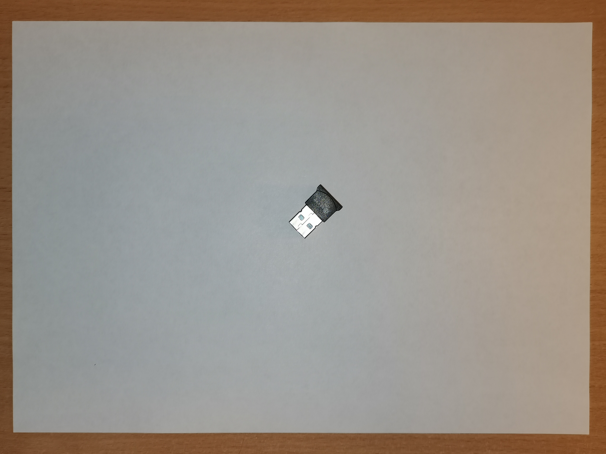
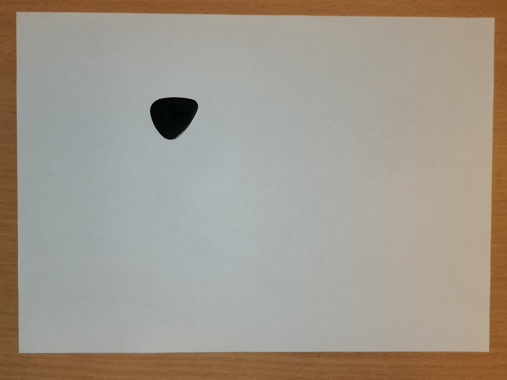
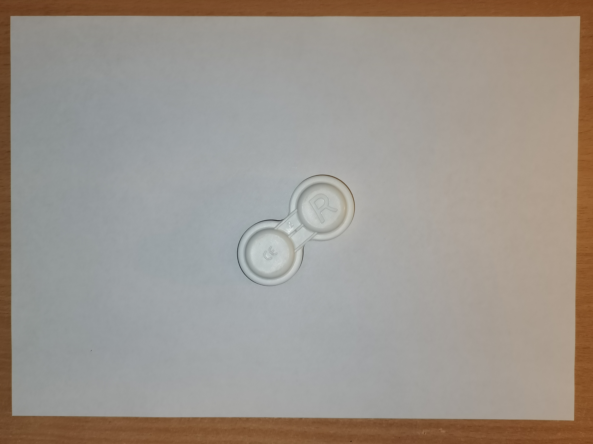
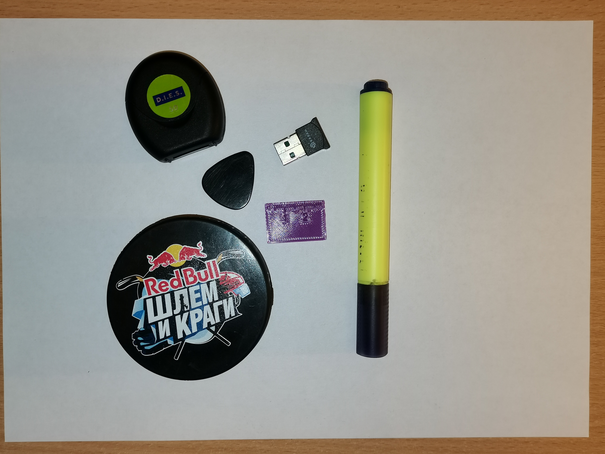
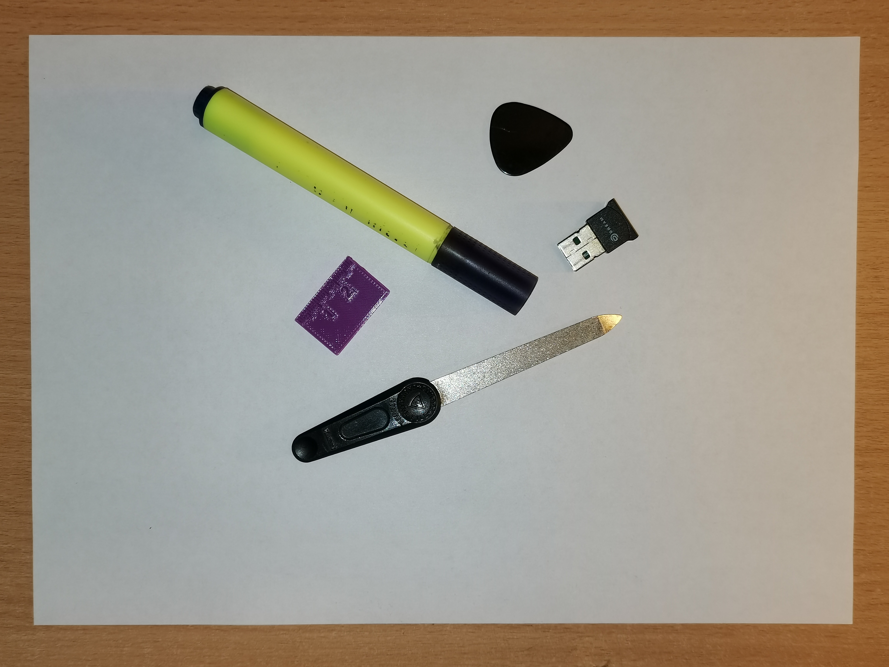
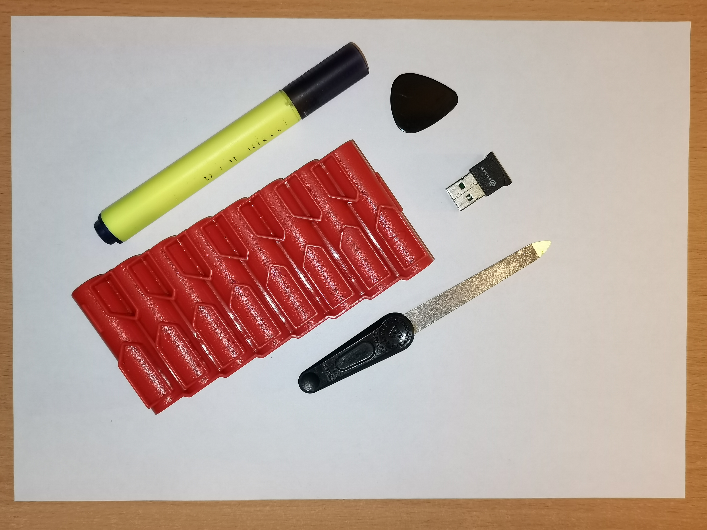

# Intelligent_Placer

## Постановка задачи

Требуется разработать python-библиотеку “intelligent_placer_lib”, решающую следующую задачу: по поданной на вход фотографии нескольких предметов на светлой горизонтальной поверхности и многоугольнику понимать, можно ли расположить одновременно все эти предметы на плоскости так, чтобы они влезли в этот многоугольник. Предметы и горизонтальная поверхность, которые могут оказаться на фотографии, заранее известны. Программа возвращает True, если на входе распознаны объекты из заранее заданного множества из 10 объектов, которые можно поместить в многоугольник, или же на входящем изображении отсутствуют какие-либо объекты в принципе. В ином случае программа возвращает False.

## Требования к изображениям предметов

1. Предметы фотографируются на фоне белого листа бумаги А4 (который попадает на фотографию целиком, так чтобы углы и края листа были видны и не перекрывались). Лист лежит на ровной светлой горизонтальной поверхности: максимальное отклонение выбранной горизонтальной плоскости от плоскости земли (плоскость земли - плоскость, линия действия силы тяжести к которой перпендикулярна) не более 5 градусов; горизонтальная плоскость считается ровной, когда максимальный перепад высот не превосходит 0.5 мм, горизонтальная плоскость считается светлой, когда коэффициент отражения ее поверхности не меньше 0.4.
2. Средняя освещенность плоскости лежит в пределах 400-550 люкс.
3. Камера при съемке расположена на высоте 20-40 см - в зависимости от угла обзора объектива и с учетом того, что толщина полос фона, обрамляющих лист бумаги А4, не превышает 0.095 доли разрешения фотографии по вертикали (приблизительно 2 см). Отклонение прямой зрения объектива от перпендикуляра к горизонтальной плоскости не превышает 7 градусов.
4. Разрешение изображений по вертикали должно быть не меньше 900 px, по горизонтали не меньше 1200 px. Отношение сторон - 4:3. Ориентация фотографии альбомная.
5. Толщина теней не превышает 0.013 доли разрешения по вертикали (приблизительно 2 мм). За толщину тени считаем максимальную длину отрезка, перпендикулярного к касательной к кривой силуэта объекта, концы отрезка при это лежат в точке касания и на кривой границы тени. Тенью считаем область белого листа бумаги, средняя освещенность которой на 300 люкс меньше средней освещенности листа бумаги, на котором отсутствуют объекты.
6. Растояние между объектам и краем листа должно быть не меньше 0.02 доли разрешения по вертикали (приблизительно 4.5 мм).
7. Объекты не должны пересекаться. Растояние между объектами должно быть не меньше 0.02 доли разрешения по вертикали  (приблизительно 4.5 мм).
8. Каждый объект присутствует на изображении не более одного раза.
9. Каждый объект обязан помещаться в прямоугольник 210x100 мм.

## Требования к многоугольникам

1. Многоугольники обязаны быть выпуклыми, число вершин каждого многоугольника не меньше 3 и не больше 12.
2. Многоугольники задаются парами координат: координаты задаются списком списков, в каждом кортеже (вершине многоугольника) хранится пара целых чисел - X, Y координаты вершины в миллиметрах.
3. Система координат задается следущим образом: начало с.к. лежит в левом верхнем углу, ось OX горизонтальна, направлена слева-направо, ось OY вертикальна, направлена сверху-вниз.
4. Списки вершин хранятся в файле polygons.json, каждый список доступен по индексу от 0 до 4.

## Разметка датасета

Размеченный [датасет](https://github.com/Dannikk/Intelligent_Placer/blob/develop/repr/data.csv) представляет собой три столбца: Image - имя изображения, находящегося в папке [repr](https://github.com/Dannikk/Intelligent_Placer/tree/develop/repr), Polygon - индекс полигона в файле [repr/polygons.json](https://github.com/Dannikk/Intelligent_Placer/blob/develop/repr/polygons.json), Label - помещается ли набор объектов в многоугольник (=0|1), (0 - False, 1 - True).

## Объекты

Примеры изображений некторых объектов:

Bluetooth адаптер:

Медиатор:

Контейнер для линз:

Остальные можно посмотреть [здесь](https://github.com/Dannikk/Intelligent_Placer/tree/develop/images).

## Входные данные

Некоторые изображения, подающиеся на вход:

Остальные [здесь](https://github.com/Dannikk/Intelligent_Placer/tree/develop/repr).
